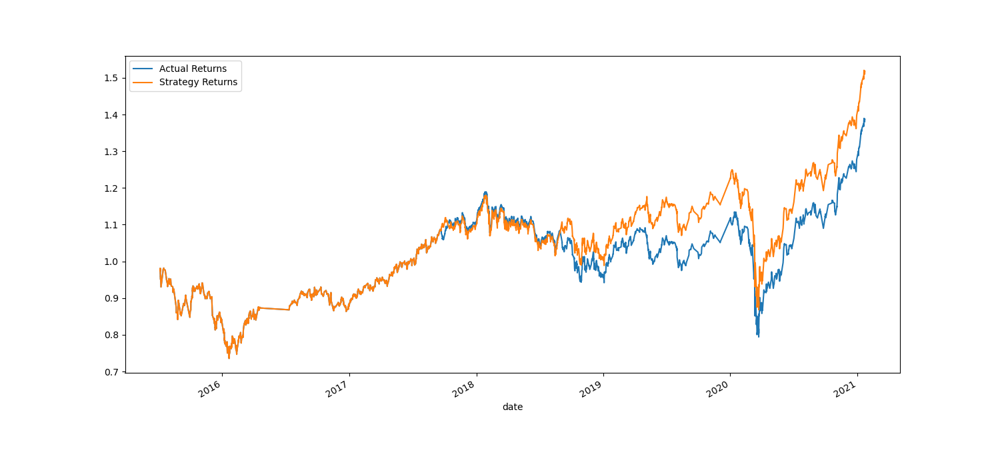

# Machine Learning Trading Evaluation Report

## Baseline performance
Using the VSC model, with a short window of 4 and a long window of 100, the data are sliced for training for a period of 3 months. The training data begin at 2015-04-02 15:00:00 and end at 2015-07-02 15:00:00. The testing data are from 2015-07-06 10:00:00 to 2021-01-22 15:45:00.

---------------------------------------------------------------------------

## Adjust the size of the training dataset

Expand the training window to increase the size of training dataset.By increasing the training window, a larger time frame of data can be included in the training set, leading to more samples for the model to learn from.

Using the VSC model, with a short window of 4 and a long window of 100, the data will be sliced for training for a period of 6 months. The training data will begin at 2015-04-02 15:00:00 and end at 2015-10-02 15:00:00. The data for testing will be from 2015-10-06 10:00:00 to 2021-01-22 15:45:00.

---------------------------------------------------------------------------

## Adjust the SMA windows
### Adjust one SMA window for the algorithm. 
Using the VSC model, with a short window of 4 and a long window of 150, the data will be sliced for training for a period of 6 months. The training data will begin at 2015-04-02 15:00:00 and end at 2015-10-02 15:00:00. The data for testing will be from 2015-10-06 10:00:00 to 2021-01-22 15:45:00.

### Adjust both of the SMA windows for the algorithm. 
Using the VSC model, with a short window of 5 and a long window of 160, the data will be sliced for training for a period of 6 months. The training data will begin at 2015-04-02 15:00:00 and end at 2015-10-02 15:00:00. The data for testing will be from 2015-10-06 10:00:00 to 2021-01-22 15:45:00.

---------------------------------------------------------------------------

## Choose the set of parameters that best improved the trading algorithm returns. 

---------------------------------------------------------------------------

## Evaluate a New Machine Learning Classifier

### 1. Use LogisticRegression model
Using the LogisticRegression model, with a short window of 4 and a long window of 100, the data will be sliced for training for a period of 3 months. The training data will begin at 2015-04-02 15:00:00 and end at 2015-07-02 15:00:00. The data for testing will be from 2015-07-06 10:00:00 to 2021-01-22 15:45:00.

### 2. Use DecisionTree modelß
Using the DecisionTree model, with a short window of 4 and a long window of 100, the data will be sliced for training for a period of 3 months. The training data will begin at 2015-04-02 15:00:00 and end at 2015-07-02 15:00:00. The data for testing will be from 2015-07-06 10:00:00 to 2021-01-22 15:45:00.

### 3. Use Nerual Network
To utilize the Neural Network model with 3 hidden node layers, the data features can be created as EMA_D3, EMA_D5, EMA_D8, EMA_D10, EMA_D12, EMA_D15, EMA_D30, EMA_D35, EMA_D40, EMA_D45, EMA_D50, and EMA_D60. The data labels can be defined as signals 1 and -1. The data are sliced for a training period of 12 months. Nerual network doesn't generate satisfied result because the dataset is small and poor data feature. To address overfitting in a Neural Network with a small dataset, modify data features by including additional indicators, apply dimensionality reduction techniques, use regularization methods, and consider data augmentation if possible.